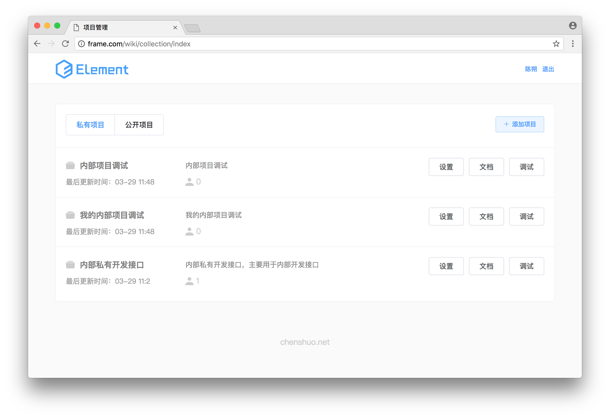

## 使用前必看

- 该项目比不完善，建议内部使用
- 你可以根据自己的需求开发定制

## 后端安装

- composer install
- cp config/env.default.php env.php
- storage/log 需要有写权限
- public/response/public 需要写权限

## web访问

http://your-domain.com/wiki

## nginx 配置

```
server {
    listen       80;
    server_name  frame.com;
    root /Users/simple/Sites/frame/public;

    location / {
        index index.html index.htm index.php;
        try_files $uri $uri/ /index.php?$query_string;
    }

    location /wiki/ {
        index index.html index.htm;
        try_files $uri $uri/ /wiki/index.html;
    }

    location ~ \.php$ {
        fastcgi_pass   127.0.0.1:9000;
        fastcgi_index  index.php;
        fastcgi_param  SCRIPT_FILENAME $document_root$fastcgi_script_name;
        include        fastcgi_params;
    }
}
```

## 前端

vue2 + elementUI

https://github.com/supkit/simple-wiki-vue

vue2 webpack 打包后，页面刷新404 问题 : http://chenshuo.net/page?id=11